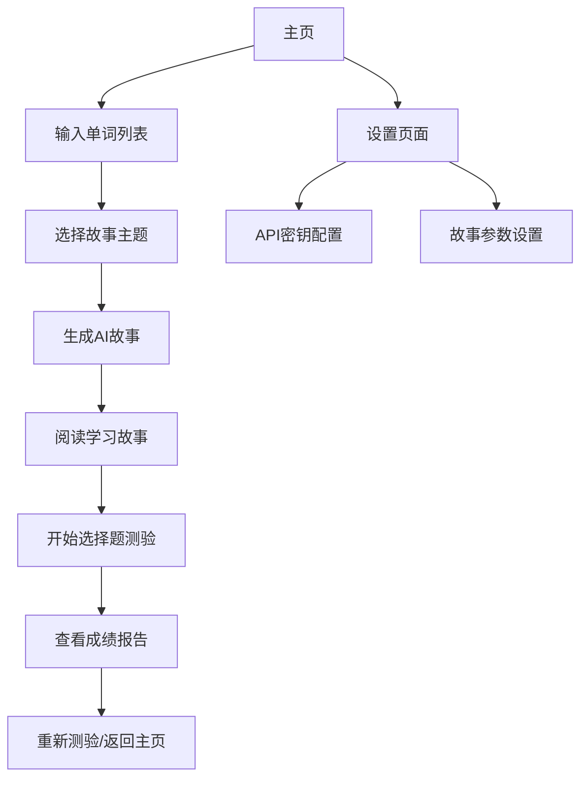

# 🐱 NekoMemo - 智能背单词Android应用

> 基于AI故事生成的沉浸式英语单词学习应用

## 📱 项目概述

NekoMemo是一款创新的英语学习应用，通过AI生成包含目标单词的连贯故事，让用户在语境中学习单词，然后通过选择题测验加强记忆。应用采用现代Android开发技术栈，支持安全的API密钥存储。

### 🎯 核心功能流程

1. **单词输入** → 用户输入要学习的英语单词列表
2. **AI故事生成** → 调用OpenAI/DeepSeek API（暂未支持）生成包含所有单词的英文故事
3. **单词提取** → 自动识别故事中的 `**word** (中文释义)` 格式
4. **智能测验** → 生成选择题，中文选项，英文题干
5. **成绩统计** → 详细的学习报告和进度追踪

## 🏗️ 技术架构

### 核心技术栈
- **UI Framework**: Jetpack Compose (Material3)
- **架构模式**: MVVM + Repository Pattern
- **异步处理**: Kotlin Coroutines + StateFlow
- **网络请求**: Retrofit2 + OkHttp3
- **安全存储**: EncryptedSharedPreferences (AES256)
- **依赖注入**: Manual DI (可扩展为Hilt)

### 支持的AI服务
- ✅ **OpenAI GPT-4o** (主要支持)
- 🔄 **DeepSeek API** (计划支持)
- 📦 **本地演示故事** (离线模式)

## 📁 项目结构

```
app/src/main/java/com/example/nekomemo/
├── MainActivity.kt                 # 主Activity + Compose入口
├── SecurePreferencesManager.kt     # 🔐 安全存储管理器
├── VocabularyViewModel.kt          # 🏗️ 主要业务逻辑
├── Models.kt                       # 📊 数据模型定义
├── OpenAIService.kt               # 🌐 网络层接口
└── ui/
    ├── screens/                   # 🎨 各个界面组件
    └── theme/                     # 🎨 主题配置
```

## 🔐 安全特性

### API密钥安全存储
```kotlin
class SecurePreferencesManager(context: Context) {
    private val sharedPreferences: SharedPreferences = EncryptedSharedPreferences.create(
        "secure_prefs",
        masterKeyAlias,
        context,
        EncryptedSharedPreferences.PrefKeyEncryptionScheme.AES256_SIV,
        EncryptedSharedPreferences.PrefValueEncryptionScheme.AES256_GCM
    )
}
```

**安全保障：**
- ✅ AES256加密存储
- ✅ Android Keystore主密钥保护
- ✅ 一键清除敏感数据
- ✅ UI层密码模式显示

## 🌐 API集成架构

### OpenAI集成
```kotlin
interface OpenAIService {
    @POST("v1/chat/completions")
    suspend fun createChatCompletion(
        @Header("Authorization") authorization: String,
        @Body request: ChatCompletionRequest
    ): Response<ChatCompletionResponse>
}
```

### 故事生成Prompt模板
```
Write a {length}-word English story including: {wordList}

Requirements:
1. Each word in **word** (中文释义) format
2. Coherent storyline with {theme} theme
3. All words appear exactly once
4. Accurate Chinese translations
```

## 🧠 核心算法

### 单词提取算法
```kotlin
fun extractWordTranslations(story: String): List<Pair<String, String>> {
    val pattern = Pattern.compile("\\*\\*(\\w+)\\*\\*\\s*\\((.*?)\\)")
    // 提取 **abandon** (放弃) 格式的单词和翻译
}
```

### 测验生成算法
```kotlin
fun generateQuizQuestions(wordTranslations: List<Pair<String, String>>): List<QuizQuestion> {
    // 1. 为每个单词生成3个干扰项
    // 2. 随机打乱选项顺序
    // 3. 记录正确答案索引
}
```

## 🚀 快速开始

### 环境要求
- **Android Studio**: Hedgehog (2023.1.1) 或更新
- **Kotlin**: 1.9.22+
- **Gradle**: 8.2
- **最低Android版本**: API 24 (Android 7.0)

### 安装步骤
```bash
# 1. 克隆项目
git clone https://github.com/your-username/nekomemo.git

# 2. 打开Android Studio
# File → Open → 选择项目文件夹

# 3. 同步依赖
# 点击 "Sync Project with Gradle Files"

# 4. 运行应用
# 连接设备或启动模拟器，点击运行按钮
```

### 配置API密钥
1. 获取OpenAI API密钥
2. 在应用设置界面输入并保存
3. 开始生成个性化故事

## 📊 应用界面流程




## 🛠️ 技术细节

### 状态管理
```kotlin
data class VocabularyUiState(
    val isLoading: Boolean = false,
    val error: String? = null,
    val currentScreen: Screen = Screen.Home,
    val apiKey: String = "",
    val storyTheme: String = "adventure",
    val storyLength: Int = 250
)
```

### 错误处理策略
- **网络错误**: 自动降级到演示故事
- **API限制**: 友好提示和重试机制
- **解析错误**: 容错处理和用户反馈

### 性能优化
- **协程**: 非阻塞UI的异步操作
- **缓存**: 故事和设置的本地缓存
- **懒加载**: Compose的高效UI渲染

## 🤝 贡献指南

### 代码规范
- 遵循Kotlin官方代码风格
- 使用有意义的变量和函数命名
- 添加必要的注释和文档

### 提交规范
```
feat: 添加DeepSeek API支持
fix: 修复单词提取正则表达式
docs: 更新README文档
style: 优化UI界面布局
```

### 开发环境设置
```bash
# 安装依赖
./gradlew dependencies

# 运行测试
./gradlew test

# 检查代码质量
./gradlew ktlintCheck
```


---

**让学习英语变得有趣又高效！🚀**