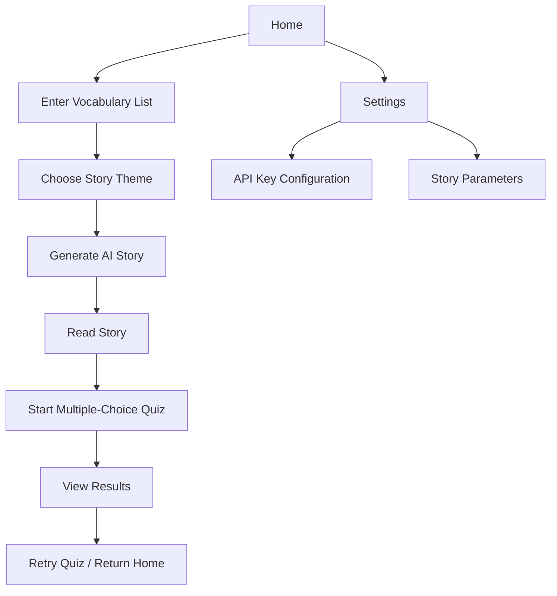

# NekoMemo - AI-Powered Vocabulary Learning Android App

> An immersive English vocabulary learning app powered by AI-generated stories

## Project Overview

NekoMemo is an English learning application that generates coherent stories containing target vocabulary words using AI. It allows users to learn words in context and reinforce their memory through multiple-choice quizzes. The app is built with a modern Android development stack and supports secure API key storage.

### Core Workflow

1. **Vocabulary Input** → Users enter a list of English words they want to learn
2. **AI Story Generation** → Calls the OpenAI/DeepSeek API (not yet supported) to generate an English story containing all target words
3. **Vocabulary Extraction** → Automatically identifies vocabulary in the `**word** (Chinese definition)` format
4. **Interactive Quiz** → Generates multiple-choice questions with Chinese answer choices and English prompts
5. **Score Tracking** → Provides detailed learning results and progress tracking

## Technical Architecture

### Core Technology Stack

- **UI Framework**: Jetpack Compose (Material3)
- **Architecture Pattern**: MVVM + Repository Pattern
- **Asynchronous Processing**: Kotlin Coroutines + StateFlow
- **Networking**: Retrofit2 + OkHttp3
- **Secure Storage**: EncryptedSharedPreferences (AES256)
- **Dependency Injection**: Manual DI (can be extended to Hilt)

### Supported AI Services

- **OpenAI GPT-4o** (primary support)
- **DeepSeek API** (planned support)
- **Local Demo Stories** (offline mode)

## Project Structure

```
app/src/main/java/com/example/nekomemo/
├── MainActivity.kt                 # Main Activity + Compose entry point
├── SecurePreferencesManager.kt     # Secure storage manager
├── VocabularyViewModel.kt          # Main business logic
├── Models.kt                       # Data model definitions
├── OpenAIService.kt                # Networking interface
└── ui/
    ├── screens/                    # UI screen components
    └── theme/                      # App theme
```

## Security Features

### Secure API Key Storage

```kotlin
class SecurePreferencesManager(context: Context) {
    private val sharedPreferences: SharedPreferences = EncryptedSharedPreferences.create(
        "secure_prefs",
        masterKeyAlias,
        context,
        EncryptedSharedPreferences.PrefKeyEncryptionScheme.AES256_SIV,
        EncryptedSharedPreferences.PrefValueEncryptionScheme.AES256_GCM
    )
}
```

**Security Measures:**

- AES256 encrypted storage
- Android Keystore master key protection
- One-click sensitive data removal
- Password-style display for API keys in the UI

## API Integration Architecture

### OpenAI Integration

```kotlin
interface OpenAIService {
    @POST("v1/chat/completions")
    suspend fun createChatCompletion(
        @Header("Authorization") authorization: String,
        @Body request: ChatCompletionRequest
    ): Response<ChatCompletionResponse>
}
```

### Story Generation Prompt Template

```
Write a {length}-word English story including: {wordList}

Requirements:
1. Each word in **word** (Chinese definition) format
2. Coherent storyline with {theme} theme
3. All words appear exactly once
4. Accurate Chinese translations
```

## Core Algorithms

### Vocabulary Extraction Algorithm

```kotlin
fun extractWordTranslations(story: String): List<Pair<String, String>> {
    val pattern = Pattern.compile("\\*\\*(\\w+)\\*\\*\\s*\\((.*?)\\)")
    // Extract vocabulary and translations in the **abandon** (放弃) format
}
```

### Quiz Generation Algorithm

```kotlin
fun generateQuizQuestions(wordTranslations: List<Pair<String, String>>): List<QuizQuestion> {
    // 1. Generate three distractor choices for each word
    // 2. Randomly shuffle the answer choices
    // 3. Record the index of the correct answer
}
```

## Getting Started

### Requirements

- **Android Studio**: Hedgehog (2023.1.1) or later
- **Kotlin**: 1.9.22+
- **Gradle**: 8.2
- **Minimum Android Version**: API 24 (Android 7.0)

### Installation

```bash
# 1. Clone the project
git clone https://github.com/your-username/nekomemo.git

# 2. Open the project in Android Studio
# File → Open → Select the project folder

# 3. Sync dependencies
# Click "Sync Project with Gradle Files"

# 4. Run the application
# Connect an Android device or launch an emulator, then click Run
```

### Configure an API Key

1. Obtain an OpenAI API key
2. Enter and save the API key on the Settings screen
3. Start generating personalized stories

## Application Flow


```mermaid
graph TB
    A[Home] --> B[Enter Vocabulary List]
    B --> C[Choose Story Theme]
    C --> D[Generate AI Story]
    D --> E[Read Story]
    E --> F[Start Multiple-Choice Quiz]
    F --> G[View Results]
    G --> H[Retry Quiz / Return Home]
    
    A --> I[Settings]
    I --> J[API Key Configuration]
    I --> K[Story Parameters]
```

## Technical Details

### State Management

```kotlin
data class VocabularyUiState(
    val isLoading: Boolean = false,
    val error: String? = null,
    val currentScreen: Screen = Screen.Home,
    val apiKey: String = "",
    val storyTheme: String = "adventure",
    val storyLength: Int = 250
)
```

### Error Handling Strategy

- **Network Errors**: Automatically falls back to a demo story
- **API Limitations**: User-friendly error messages and retry mechanism
- **Parsing Errors**: Fault-tolerant handling and user feedback

### Performance Optimizations

- **Coroutines**: Asynchronous processing without blocking the UI
- **Caching**: Local caching for stories and settings
- **Lazy Loading**: Efficient UI rendering using Compose

## Contribution Guide

### Code Style

- Follow the official Kotlin coding conventions
- Use meaningful variable and function names
- Add comments and documentation where necessary

### Commit Convention

```
feat: add DeepSeek API support
fix: fix vocabulary extraction regex
docs: update README documentation
style: improve UI layout
```

### Development Environment

```bash
# Install dependencies
./gradlew dependencies

# Run tests
./gradlew test

# Check code quality
./gradlew ktlintCheck
```

---

**Making English vocabulary learning more engaging and effective!**
